<div align="center">

<!-- BANNER (generado por scripts/generate.py) -->
<a href="https://github.com/JhonierSantana">
  <picture>
    <source media="(prefers-color-scheme: dark)" srcset="assets/banner-dark.svg">
    <source media="(prefers-color-scheme: light)" srcset="assets/banner-light.svg">
    
  </picture>
</a>

<br>

<a href="https://github.com/JhonierSantana">
  
</a>

<br>

<a href="https://www.linkedin.com/in/jhonier-yesid-santana-pedroza-457492265"></a>
<a href="mailto:jhonier_2504@hotmail.com"></a>


</div>

---

## `$ whoami`

<p align="center">
  <picture>
    <source media="(prefers-color-scheme: dark)" srcset="assets/whoami-dark.svg">
    <source media="(prefers-color-scheme: light)" srcset="assets/whoami-light.svg">
    
  </picture>
</p>

Construyo productos **web, móviles y de escritorio** sobre el ecosistema **React + TypeScript**. Mi trabajo está en la capa donde el producto se encuentra con el usuario: arquitectura de componentes, gestión de estado, integración con APIs REST y rendimiento de la interfaz.

Me importa el software que el siguiente desarrollador puede leer, extender y desplegar sin miedo: tipado estricto, módulos con responsabilidades claras y decisiones técnicas documentadas.

---

<div align="center">

## `$ cat stack.config.ts`

<table>
  <thead>
    <tr>
      <th colspan="2" align="left"><code>jhonier@dev:~$ cat stack.config.ts</code></th>
    </tr>
  </thead>
  <tbody>
    <tr>
      <td width="50%" valign="top"><code>├─ ⚛ core:</code><br><br>
        <br>
        <sub><code>React · TypeScript · JavaScript · HTML · CSS · Sass</code></sub>
      </td>
      <td width="50%" valign="top"><code>├─ ▣ multiplatform:</code><br><br>
        
        <br>
        <sub><code>React Native · Electron · Expo</code></sub>
      </td>
    </tr>
    <tr>
      <td valign="top"><code>├─ ◆ ui_systems:</code><br><br>
        
        <br>
        <sub><code>Tailwind CSS · Material UI · Chakra UI</code></sub>
      </td>
      <td valign="top"><code>├─ ⇄ state_data:</code><br><br>
        
        <br>
        <sub><code>Redux Toolkit · TanStack Query · Firebase</code></sub>
      </td>
    </tr>
    <tr>
      <td valign="top"><code>├─ ▤ backend_db:</code><br><br>
        <br>
        <sub><code>Node.js · MySQL · Python</code></sub>
      </td>
      <td valign="top"><code>╰─ ⚙ workflow:</code><br><br>
        <br>
        <sub><code>Git · GitHub · GitHub Actions · Testing</code></sub>
      </td>
    </tr>
  </tbody>
  <tfoot>
    <tr>
      <td colspan="2"><code>strict: true&nbsp;&nbsp;·&nbsp;&nbsp;target: web | mobile | desktop</code></td>
    </tr>
  </tfoot>
</table>

</div>

---

## `$ git log --career`

```diff
+ HEAD -> main
```

#### `● Seguridad Penta / Bartik` — Software Developer
<sub><code>may 2025 → presente</code> · SaaS · web · mobile · desktop</sub>

- Construyo y evoluciono interfaces de productos **SaaS multiplataforma** (web, mobile y desktop) sobre React, React Native y Electron.
- Implemento **arquitectura frontend** para aplicaciones SaaS y su integración con APIs REST.
- Ejecuto **migraciones y actualizaciones de dependencias** para mantener las aplicaciones seguras, estables y al día.
- Entrego funcionalidades de punta a punta: desarrollo, resolución de incidencias y pruebas funcionales.
- Contribuyo a elevar la **calidad, estabilidad y mantenibilidad** del software del equipo.

#### `○ Attendv / BeTek` — Software Developer
<sub><code>may 2024 → oct 2024</code> · plataforma de servicios bajo demanda</sub>

- Desarrollé la interfaz web de la plataforma con **React**.
- Integré autenticación, datos y servicios con **Firebase**.
- Mejoré **rendimiento, UX y SEO** de las vistas principales.
- Participé en el flujo de desarrollo y despliegue de la aplicación.

---

## `$ npm run radar`

<p align="center">
  <picture>
    <source media="(prefers-color-scheme: dark)" srcset="assets/radar-skills-dark.svg">
    <source media="(prefers-color-scheme: light)" srcset="assets/radar-skills-light.svg">
    
  </picture>&nbsp;
  <picture>
    <source media="(prefers-color-scheme: dark)" srcset="assets/radar-platforms-dark.svg">
    <source media="(prefers-color-scheme: light)" srcset="assets/radar-platforms-light.svg">
    
  </picture>
</p>

<p align="center"><sub><code>build: passing · source: profile.json · regenerado por GitHub Actions</code></sub></p>

---

## `$ cat roadmap.md`

```ts
const nextUp = {
  architecture: ['arquitectura frontend escalable', 'design systems'],
  mobile:       ['React Native + Expo', 'performance en mobile'],
  quality:      ['testing', 'buenas prácticas', 'código mantenible'],
} as const;
```

---

## `$ curl contact.dev`

<div align="center">

Abierto a conectar con equipos que construyen producto digital en serio.

<a href="https://www.linkedin.com/in/jhonier-yesid-santana-pedroza-457492265"></a>&nbsp;
<a href="mailto:jhonier_2504@hotmail.com"></a>&nbsp;
<a href="https://github.com/JhonierSantana"></a>

<br><br>

<sub>Construido con React en la cabeza y café colombiano en la taza · <code>@JhonierSantana</code></sub>

</div>
